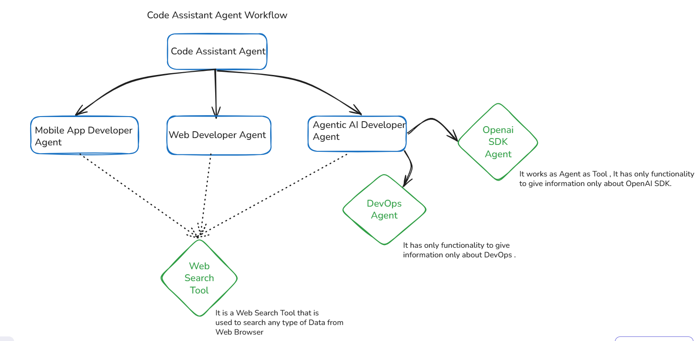

# Multi-Agent Development Assistant Platform

## Project Overview
A sophisticated AI-powered development platform that utilizes **six specialized expert agents** to provide comprehensive guidance and assistance across all software development domains. Each agent is designed to handle specific areas of expertise while working together seamlessly through intelligent handoffs and coordination.

## 🏗️ Agent Architecture
### Demo Workflow


### 🎯 Triage Agent (Bushra Code Assistant)
- **Role**: Principal Solutions Architect and Lead Full-Stack Cloud Mentor
- **Expertise**: Comprehensive technical leadership across all development domains
- **Capabilities**:
  - Intelligent query routing to appropriate specialist agents
  - Multi-domain project coordination and architecture decisions
  - End-to-end technical leadership from concept to deployment
  - Production-grade, cost-efficient, and secure system design
  - Cross-domain validation and integration oversight

### 1. 🌐 Web Developer Agent
- **Expertise**: Full-stack web development
- **Capabilities**:
  - Frontend: HTML5, CSS3, JavaScript, TypeScript, React, Next.js, Vue, Angular, Svelte, Tailwind CSS
  - Backend: Node.js, Express/NestJS, Python, FastAPI/Django, REST/GraphQL APIs
  - Databases: SQL, MySQL, MongoDB, Redis, Airtable
  - DevOps: Docker, CI/CD, AWS integration
  - Professional code generation with comprehensive comments

### 2. 📱 Mobile App Developer Agent
- **Expertise**: Mobile and game application development
- **Capabilities**:
  - iOS: Swift, SwiftUI, UIKit development
  - Android: Kotlin, Jetpack Compose
  - Cross-platform: React Native, Flutter, Xamarin
  - Game Development: Unity, Unreal Engine, Godot
  - Desktop: Electron, Tauri, .NET MAUI
  - App Store deployment and publishing guidance

### 3. 🤖 Agentic AI Developer Agent
- **Expertise**: AI agent development and integration
- **Capabilities**:
  - Multi-agent system design and orchestration
  - LLM integration: OpenAI, Anthropic, Gemini
  - Frameworks: OpenAI SDK, LangChain, CrewAI, AutoGPT
  - Tool integration and function calling
  - Agent communication protocols and handoffs
  - RAG systems and vector databases
  - AI safety and guardrails implementation

### 4. 🚀 DevOps & Infrastructure Agent
- **Expertise**: DevOps, CI/CD, and cloud infrastructure
- **Capabilities**:
  - Containerization: Docker, Kubernetes, Helm charts
  - CI/CD: GitHub Actions, GitLab CI, Jenkins
  - Cloud Platforms: AWS, Azure, GCP, DigitalOcean
  - Infrastructure as Code: Terraform, AWS CDK
  - Monitoring, logging, and observability
  - Performance optimization and scalability

### 5. 📊 Data Science Agent
- **Expertise**: Data science and analytics
- **Capabilities**:
  - Data Analysis: Cleaning, preprocessing, exploration
  - Machine Learning: Supervised/unsupervised models, validation
  - Statistical Analysis: Hypothesis testing, regression, time-series
  - Data Visualization: Dashboards, business intelligence
  - ETL Processes: Data extraction, transformation, loading
  - Big Data: Hadoop, Spark, Dask processing
  - Predictive Analytics: Forecasting, simulations

### 6. ⛓️ Blockchain & Web3 Agent
- **Expertise**: Blockchain and decentralized applications
- **Capabilities**:
  - Smart Contracts: Solidity, Rust, Vyper development
  - DApps: Decentralized application development
  - Blockchain Integration: Ethereum, Polygon, Solana
  - Tokenomics: Token economies, staking, governance
  - DeFi & NFTs: Protocol development and analysis
  - Web3 Infrastructure: Nodes, RPCs, IPFS, oracles
  - Security: Smart contract auditing and vulnerability assessment

## 🚀 Advanced Features

### 🧠 Intelligent Agent Coordination
- **Smart Routing**: Automatically directs queries to the most appropriate specialist agent
- **Multi-Domain Handoffs**: Seamless coordination between agents for complex projects
- **Hierarchical Agent Structure**: Agents can use other agents as tools for specialized tasks
- **Cross-Domain Validation**: Ensures consistency across all development domains

### 🛡️ Security & Guardrails
- **Input Validation**: Advanced guardrails to ensure queries are programming-related
- **Content Filtering**: Prevents non-technical queries from being processed
- **Safe AI Practices**: Built-in safety measures for AI agent interactions
- **Error Handling**: Comprehensive exception handling and graceful degradation

### 💾 Memory Management
- **Persistent Memory**: Long-term memory storage using Mem0 for user context
- **Session Management**: SQLite-based session persistence across conversations
- **Context Awareness**: Maintains conversation history and user preferences
- **Memory Search**: Intelligent retrieval of relevant past interactions

### 🔧 Advanced Tool Integration
- **Web Search**: Real-time information retrieval using Tavily API
- **Memory Tools**: Save and search user memories for personalized assistance
- **Agent Tools**: Agents can use other agents as specialized tools
- **Dynamic Tool Selection**: Automatic tool selection based on context

### 📊 Monitoring & Analytics
- **Run Hooks**: Comprehensive lifecycle monitoring of agents and tools
- **Performance Tracking**: Monitor agent handoffs, tool usage, and response times
- **Session Analytics**: Track user interactions and system performance
- **Debug Information**: Detailed logging for troubleshooting and optimization

### 🎯 Production-Ready Features
- **Streaming Responses**: Real-time token streaming for better user experience
- **Error Recovery**: Graceful handling of failures and edge cases
- **Scalable Architecture**: Designed for high-volume usage and concurrent users
- **Professional Code Generation**: Production-ready code with comprehensive comments

## 🛠️ Technical Stack

### Core Technologies
- **Language**: Python 3.13+
- **Framework**: Chainlit for interactive UI
- **AI Models**: 
  - Gemini 2.5 Pro (Primary)
  - Gemini 2.0 Flash (Guardrails)
- **Memory System**: Mem0 for persistent user memory
- **Session Management**: SQLite for conversation persistence

### Key Libraries & Dependencies
- **AI & Agents**:
  - `openai-agents` - Multi-agent orchestration framework
  - `AsyncOpenAI` - Asynchronous OpenAI client
  - `mem0` - Long-term memory management
- **Web & Search**:
  - `tavily` - Real-time web search capabilities
  - `chainlit` - Interactive chat interface
- **Utilities**:
  - `python-dotenv` - Environment variable management
  - `pydantic` - Data validation and settings
  - `dataclasses` - Structured data handling

### Architecture Components
- **Agent Framework**: OpenAI Agents SDK with custom extensions
- **Memory Layer**: Mem0 API integration for user context
- **Search Layer**: Tavily API for real-time information
- **Session Layer**: SQLite database for conversation persistence
- **Security Layer**: Custom guardrails and input validation

## 🛡️ Security & Guardrails System

### Input Validation Guardrails
The platform implements sophisticated guardrails to ensure all interactions remain focused on programming and development topics:

#### 🎯 Content Filtering
- **Programming Focus**: Automatically detects and filters non-technical queries
- **Greeting Handling**: Allows appropriate greetings while maintaining focus
- **Context Awareness**: Understands the difference between technical and non-technical discussions

#### 🔍 Guardrail Implementation
```python
@input_guardrail
def related_message(ctx: RunContextWrapper, agent: Agent, input):
    # Validates if input is programming-related
    result = Runner.run_sync(quard_agent, input)
    return GuardrailFunctionOutput(
        output_info="Check if the code is related to Coding or Programming",
        tripwire_triggered=result.final_output.is_non_technical
    )
```

#### 🚨 Security Features
- **Input Sanitization**: Cleans and validates all user inputs
- **Content Classification**: Uses AI to classify query relevance
- **Automatic Rejection**: Blocks non-programming related queries
- **Error Handling**: Graceful handling of invalid inputs with helpful messages

#### 🎛️ Guardrail Configuration
- **Model**: Gemini 2.0 Flash for fast classification
- **Temperature**: 0.4 for consistent, reliable classification
- **Output Type**: Structured validation with boolean flags
- **Integration**: Seamlessly integrated with all agent interactions

### 🔒 Additional Security Measures
- **Session Isolation**: Each user session is completely isolated
- **Memory Privacy**: User memories are stored securely with proper access controls
- **API Key Protection**: All API keys are securely managed through environment variables
- **Error Boundaries**: Comprehensive error handling prevents information leakage

## 🚀 Setup and Installation

### Prerequisites
- Python 3.13+
- UV package manager (recommended) or pip
- API keys for required services

### Installation Steps
1. **Clone the repository**:
   ```bash
   git clone <repository-url>
   cd Code_Assistant_agent
   ```

2. **Create virtual environment**:
   ```bash
   python -m venv .venv
   source .venv/bin/activate  # On Windows: .venv\Scripts\activate
   ```

3. **Install dependencies**:
   ```bash
   uv add openai-agents
   uv add chainlit
   uv add mem0
   uv add tavily
   uv add python-dotenv
   uv add pydantic
   ```

4. **Configure environment variables**:
   Create a `.env` file in the project root:
   ```env
   GEMINI_API_KEY=your_gemini_api_key_here
   TAVILY_API_KEY=your_tavily_api_key_here
   OPENAI_API_KEY=your_openai_api_key_here
   MEM0_API_KEY=your_mem0_api_key_here
   ```

5. **Run the application**:
   ```bash
   chainlit run main.py
   ```

## 💡 Usage Examples

### 🌐 Web Development Queries
```python
# Frontend Development
"How do I create a responsive navigation bar with React and Tailwind CSS?"
"Show me how to implement authentication in Next.js with JWT tokens"
"Create a modern dashboard layout with TypeScript and Material-UI"

# Backend Development
"Build a REST API with FastAPI and PostgreSQL"
"How to implement real-time features with WebSockets in Node.js?"
"Create a GraphQL server with authentication and authorization"
```

### 📱 Mobile & Game Development
```python
# Mobile App Development
"Build a React Native app with navigation and state management"
"Implement push notifications in Flutter for iOS and Android"
"Create a cross-platform mobile app with offline capabilities"

# Game Development
"Develop a 2D platformer game with Unity"
"Create a multiplayer game with real-time synchronization"
"Build a mobile game with in-app purchases and ads"
```

### 🤖 AI & Agent Development
```python
# AI Agent Systems
"Create a multi-agent system with OpenAI SDK"
"Build a RAG system with vector databases"
"Implement function calling with custom tools"
"Design an AI agent workflow with error handling"

# LLM Integration
"Integrate multiple LLM providers in a single application"
"Create a conversational AI with memory and context"
"Build an AI-powered code review system"
```

### 🚀 DevOps & Infrastructure
```python
# Containerization & Orchestration
"Set up a Kubernetes cluster with Helm charts"
"Create Docker containers for a microservices architecture"
"Implement CI/CD pipelines with GitHub Actions"

# Cloud Infrastructure
"Deploy a scalable web application on AWS"
"Set up monitoring and logging with Prometheus and Grafana"
"Create infrastructure as code with Terraform"
```

### 📊 Data Science & Analytics
```python
# Data Analysis
"Analyze sales data and create predictive models"
"Build a recommendation system with machine learning"
"Create interactive dashboards with real-time data"

# Big Data Processing
"Process large datasets with Apache Spark"
"Implement ETL pipelines for data warehousing"
"Create data visualization with D3.js and Python"
```

### ⛓️ Blockchain & Web3
```python
# Smart Contract Development
"Create a DeFi protocol with Solidity"
"Build an NFT marketplace with smart contracts"
"Implement a token staking mechanism"

# Web3 Integration
"Connect a web app to Ethereum blockchain"
"Create a decentralized voting system"
"Build a Web3 wallet integration"
```

### 🔧 Advanced Features
```python
# Memory Management
"Remember my project preferences and coding style"
"Search my previous conversations about React patterns"
"Save important code snippets for future reference"

# Multi-Domain Projects
"Build a full-stack application with AI features"
"Create a mobile app with blockchain integration"
"Develop a data analytics platform with real-time updates"
```

## 📁 Project Structure
```
Code_Assistant_agent/
├── main.py                    # Main Chainlit application entry point
├── agent_definations.py       # All agent definitions and configurations
├── system_prompt.py          # Dynamic system prompts for each agent
├── quardrials.py             # Security guardrails and input validation
├── pyproject.toml            # Project dependencies and configuration
├── uv.lock                   # Lock file for reproducible builds
├── Code_Assistant.db         # SQLite database for session persistence
├── Demo_Picture.png          # Architecture diagram
└── README.md                 # This documentation
```

## 🔄 Agent Workflow

### 1. **Query Reception**
- User submits a query through Chainlit interface
- Input validation guardrails check query relevance
- Triage agent analyzes and routes to appropriate specialist

### 2. **Agent Handoff**
- Intelligent routing based on query domain (70%+ threshold)
- Multi-domain projects trigger parallel agent coordination
- Cross-domain validation ensures consistency

### 3. **Specialist Processing**
- Specialist agent processes query with domain expertise
- Uses available tools (web search, memory, other agents)
- Generates production-ready code and solutions

### 4. **Response Generation**
- Streaming response delivery for real-time feedback
- Memory storage for future reference
- Comprehensive documentation and examples

## 🎯 Key Concepts

### **Multi-Agent Orchestration**
- **Hierarchical Structure**: Agents can use other agents as tools
- **Intelligent Routing**: Automatic query classification and routing
- **Cross-Domain Coordination**: Seamless integration across specialties

### **Memory Management**
- **Persistent Memory**: Long-term storage of user preferences and context
- **Session Persistence**: Conversation history across sessions
- **Context Awareness**: Intelligent retrieval of relevant past interactions

### **Security & Guardrails**
- **Input Validation**: AI-powered content filtering
- **Programming Focus**: Ensures all interactions remain technical
- **Error Handling**: Graceful degradation and user-friendly error messages

### **Production-Ready Features**
- **Streaming Responses**: Real-time token delivery
- **Professional Code**: Production-ready code with comprehensive comments
- **Scalable Architecture**: Designed for high-volume usage

## 🤝 Contributing
Contributions are welcome! Please feel free to submit a Pull Request.

### Development Guidelines
- Follow Python best practices and PEP 8
- Add comprehensive tests for new features
- Update documentation for any changes
- Ensure all agents maintain their specialized focus

## 📄 License
MIT License - feel free to use and modify as needed.

## 👨‍💻 Contact
- **Author**: Abdullah Malik
- **GitHub**: [@AbdullahMalik17](https://github.com/AbdullahMalik17)
- **Project**: Multi-Agent Development Assistant Platform

---

*Built with ❤️ using OpenAI Agents SDK, Chainlit, and advanced AI technologies*
