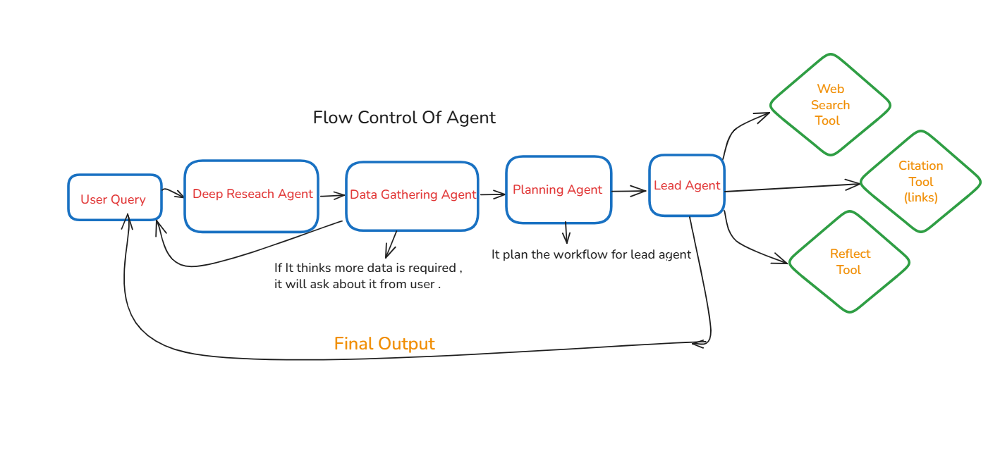

# Deep Research Agent 🔍

A sophisticated AI-powered deep research Agent  and reseach ## 🛠️ Technical Details

### System Architecture
- Tools are implemented using the `@function_tool` decorator
- Multi-agent system with specialized roles:
  ```python
  agents=[requirement_gathering_agent, planning_agent, lead_agent, web_search]
  ```
- Context management via dataclass: `Runner.run_streamed(..., context=Info(...))`
- Real-time response streaming with event-based architecture

# Demo Picture


### 🎯 Usage Examples

1. Research Queries:
   - "Analyze the latest developments in quantum computing"
   - "Summarize recent AI regulations in the EU"
   - "Compare different approaches to sustainable energy"

2. Profile Information:
   - "What's my profile information?"
   - "Show my personal details"

## ⚙️ Configuration

### Model Settings
```python
model = OpenAIChatCompletionsModel(
    openai_client=provider,
    model="gemini-2.5-flash"
)
```

### Agent Settings
- Temperature: 1.9 (Adjustable for creativity vs precision)
- Tool Choice: "Auto" Agent decides the usage of tools .

## 🌟 Features

- **Multi-Agent System Architecture**
  - Requirement Gathering Agent for understanding user needs
  - Planning Agent for strategic research planning
  - Lead Agent for project coordination
  - Web Search Agent for real-time information retrieval

- **Advanced Web Search Integration**
  - Powered by Tavily API for accurate and fresh web results
  - Structured response formatting with source attribution
  - Real-time data fetching and processing

- **Interactive Chat Interface**
  - Built with Chainlit for smooth user interaction
  - Chat history management

## 🔧 Requirements

- Python 3.13 or higher
- Environment variables in `.env`:
```env
GEMINI_API_KEY=your_gemini_key_here
TAVILY_API_KEY=your_tavily_key_here
```

## 🚀 Installation & Setup

1. Clone the repository and navigate to the project directory:
```bash
git clone [your-repo-url]
cd web-search-agent
```

2. Create and activate a virtual environment:
```bash
python -m venv venv
# On Windows
.\venv\Scripts\activate
# On Unix or MacOS
source venv/bin/activate
```

3. Install dependencies using uv:
```bash
uv install
```

4. Start the application:
```bash
uv run chainlit run deep_research_system.py
```

## 📁 Project Structure
```
Web_Search_Agent/
├── main.py                 # Entry point and core application
├── deep_research_system.py # Agent system implementation
├── research_agents.py      # Agent definitions and configurations
├── tools.py               # Utility functions and tools
├── pyproject.toml         # Project dependencies and settings
├── chainlit.md           # Welcome screen configuration
└── README.md             # Documentation
```

### How it works
- Tools are defined with `@function_tool`.
- The agent registers: `tools=[web_search, get_info]`.
- Local context is passed as a dataclass instance: `Runner.run_streamed(..., context=Info(...))`.
- Inside tools, access context via `Wrapper.context` (type-safe with `RunContextWrapper[Info]`).
- Responses are streamed using `Runner.run_streamed(...).stream_events()`.

### Usage examples
- “Search the latest news about AI regulation and summarize key points.”
- “What is my profile info?” (invokes `get_info` and returns values from `Info`)

### Configuration tips
- Model: adjust `model="gemini-2.5-flash"` in `main.py` as needed.
- Tool choice: `ModelSettings(tool_choice="auto")` lets the model decide when to use tools.
- Temperature: increase for creativity, decrease for factual responses.

## 🔒 Security Best Practices

1. **API Key Management**
   - All API keys stored in `.env`
   - Environment variable validation
   - No hardcoded credentials

2. **Data Privacy**
   - Local context management for sensitive data
   - Minimal PII exposure in prompts
   - Secure data handling in tools

## ❗ Troubleshooting

### Common Issues and Solutions
1. **API Connection Issues**
   - Verify API keys in `.env`
   - Check network connectivity
   - Validate API endpoint status

2. **Agent Behavior Issues**
   - Confirm correct tool registration
   - Check agent configuration
   - Verify model settings

3. **Performance Optimization**
   - Adjust model temperature
   - Fine-tune tool usage settings
   - Optimize search parameters

## 📄 License

MIT License - Feel free to use and modify as needed.

## 👨‍💻 Author

Abdullah Malik (`@AbdullahMalik17`)

---

For bug reports, feature requests, or contributions, please create an issue in the repository.
